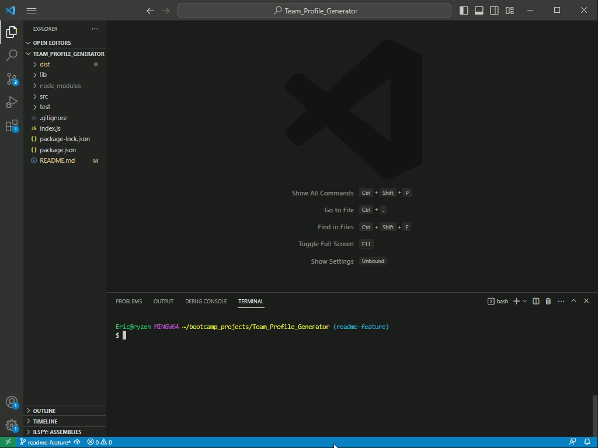
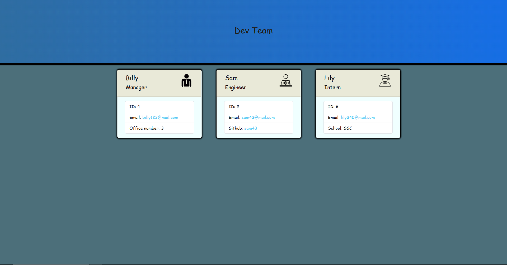

# Team_Profile_Generator
## Description
This project consist of a Node.js application using Inquirer that takes information about a development team and generates a template through the command-line. Other technologies that were used in this application were Bootstrap and Google Fonts. This app also consist of using Test Driven Development for testing the implemented features.
## Installation
To setup the application use must first type in the command-line **npm install inquirer@8.00** and then **node index** to prompt Inquirer and set the dev team information.
## Demo

## Testing
To test the Node.js application you must install Jest by typing **npm install jest** in the command-line. Then type in **npm test** in the command-line to start testing. 
## License
ISC License

Copyright (c) [2023] [Eric Mellin Alvarado]

Permission to use, copy, modify, and/or distribute this software for any
purpose with or without fee is hereby granted, provided that the above
copyright notice and this permission notice appear in all copies.

THE SOFTWARE IS PROVIDED "AS IS" AND THE AUTHOR DISCLAIMS ALL WARRANTIES WITH
REGARD TO THIS SOFTWARE INCLUDING ALL IMPLIED WARRANTIES OF MERCHANTABILITY
AND FITNESS. IN NO EVENT SHALL THE AUTHOR BE LIABLE FOR ANY SPECIAL, DIRECT,
INDIRECT, OR CONSEQUENTIAL DAMAGES OR ANY DAMAGES WHATSOEVER RESULTING FROM
LOSS OF USE, DATA OR PROFITS, WHETHER IN AN ACTION OF CONTRACT, NEGLIGENCE OR
OTHER TORTIOUS ACTION, ARISING OUT OF OR IN CONNECTION WITH THE USE OR
PERFORMANCE OF THIS SOFTWARE.